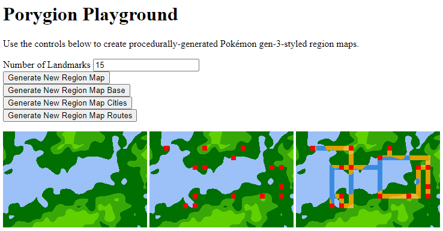

# Porygion Playground

Use it online here: http://www.huderlem.com/porygion-playground/

This is an online playground for [Porygion](https://github.com/huderlem/porygion), a procedural region map generator in the Gen-3 Pokémon style.



# Getting Started with Development

These instructions will get you setup and working with the Porygion Playground locally.

## Building and Running Locally

First, install [Go](http://golang.org).  Porygion Playground, uses Go's WebAssembly support to interface with the JavaScript on the webpage.

Clone and navigate to the Porygion working directory. To build, you must specify that WebAssembly is the target.
```
GOARCH=wasm GOOS=js go build -o main.wasm main.go
```
If you're on Windows, you might be better off running them in separate commands:
```
set GOARCH=wasm
set GOOS=js
go build -o main.wasm main.go
```

This will create a `main.wasm` file which contains the Porygion logic.

Next, run a local web server in the current directory. Any web server will work.  I use `goexec`:
```
# install goexec: go get -u github.com/shurcooL/goexec
goexec "http.ListenAndServe(`:8080`, http.FileServer(http.Dir(`.`)))"
```

Finally, visit `http://localhost:8080/`, and you should see the page up and running. The `main.wasm` payload is automatically loaded when the page is loaded. Look in the browser's debugging console to see if there are any errors reported.
